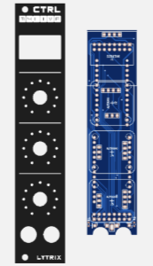
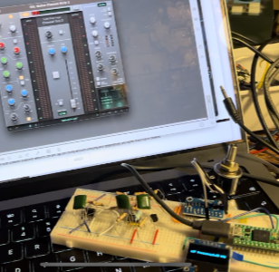
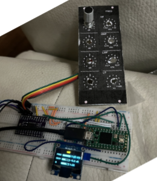
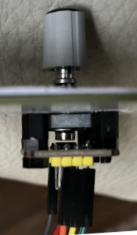

# Max4Live Magnetic Encoder controller with oled screen 

This repository contain the files to be able to create a Max4live 4 controller with Oled as a 5HP Eurorack module to control your VST plugins.

This setup can easily be extended to a 4 units by using jumper cables on the same pcb together with the headers on the boards to maximize a 5 panel order from jlcpcb.

### History ###

After using excelent Eurorack Droid system and having created my own Launchpad type solution on it, I wanted to have more the hands on controllers also for my DAW controls.

I really like the SSL suite of EQ's so I first looked at the UC1, As it was too big to fit in my small studio, I decided to build my own eurorack version to fit into my controller case with visual feedback to limit having to look at the DAW screen when adjusting EQ. 

#### MIDI? ####
I discovered early on the 127 midi steps were not fine grained enough.
Even using the pitchbend range or using MSB/LSB (sending on CC1 + CC 32) were often with issues still:
1. Still quite noisy with an analog encoder so hard to dail in precise values
2. Ableton could not set a parameter as 14bit midi 

So after some experimentation I decided to go with using an 3 euro AS5600 magnetic encoder and a cheap 0.75 Euro EC11 encoder to get a noise free 12bit 4096 step resolution which was precise enough to dail precise frequencies using this video as an example:
https://www.youtube.com/watch?v=1UmqNF65rck

This worked surpisingly well and is a great hack!

#### SYNC mouse and controller input ####
The next challenge was to ensure the encoder did not switch back to 0 halfway if the parameter changed via mouse input or when the parameter type changed. 
The solution was to set the offset of the magnetic encoder chip when the value changed externally. That way the encoder is always in sync before it adjusts it's value.

I coded a piece of logic to ensure whenever the value of the encoder is outside of +-2 numbers, MaxMSP sends an offset value update to the Teensy. 
The encoder is only allowed to change the values when the values of the VST parameter and the AS5600 offset are the same.

Th next challenge was to ensure the value was updated before the encoder could output any values. Here I got a lot of race condition issues, and it took me a week before I could tackle this. 

#### Controller & Display updates ####
For all functions I use lists to iterate over all changed values which are updated and also to set each of the AS5600 controllers and OSC adresses within different functions. This makes the code more DRY and makes it easier to add more parameters.

I created one function to gather all values to be displayed which loops in the main loop of the Arduino code.
I also created one function to set all updates from the encoders
And created one function to parse to each specific OSC address recieving part. 

### Parts list ###
- 1 Teensy 4.0 with headers
- 4-16 [AS5600 magnetic angle sensors](https://www.tinytronics.nl/shop/en/sensors/magnetic-field/as5600-magnetic-angle-sensor-encoder-module)
- 4-16 [EC11 rotary encoders](https://www.tinytronics.nl/shop/en/switches/manual-switches/rotary-encoders/rotary-encoder-ec11-20mm)
- 1-4 [25mm wide SSD1306 Oled Screens](https://www.gadgetbouw.nl/shop/0-96inch-128x64-i2c-oled-scherm-ssd1306-wit-of-blauw/)
- 1-5 PCB boards from jlcpcb
- 1-5 Alu front panels from jlcpcb
- Header pins and sockets
- [M3 nylon spacers 6mm](https://www.amazon.nl/dp/B07CG7F2YL?psc=1&ref=ppx_yo2ov_dt_b_product_details)
- [M3 nylon nuts](https://www.amazon.nl/dp/B07CG4C5QY?psc=1&ref=ppx_yo2ov_dt_b_product_details)
- 1 Superglue for mounting magnets and spacers
- 2-8 pushbuttons [EAO](https://www.techniekwebshop.nl/eao-benelux-serie-19-drukknop-9x9-puls-1m-verlicht-verkoop-per-1-x-1-stuk-19-451-035-7011339-type-knop-hoog-kleur-knop-zonder-toetsenplaat-bouwvorm-lens-vierkant-gatdiameter-8-mm-breedte-opening-0-mm-hoogte-opening-0-mm-geschikt-voor-verlichting.html) or cheaper 9.2mm types from [Ebay](https://www.ebay.com/itm/154221529860?hash=item23e851cb04:g:r4gAAOSwfl1gFLhZ&amdata=enc%3AAQAIAAAAwH2u8qPl33Nu%2BKZJNMI1XoYbnsN1xgGI8EFPX4nB848Pm47jGUqLpj%2F8kNmLPnr4k61d1Jy8z%2B8IwcQQGUOk3j0dQ3JgpBgDFUv3wmNJlS293fUbqb7MbdbXtsG7Uovn64k0coLJQ3QYye3IVVsqrKsjZNJoqrGjTdVRb0ej1huffO7VVyLBjE%2BA2dLggxsoLtFlr8CELEeITrrbJl9YzDZL0jUuFreZLzMQduZDw08uBwdF%2BrDNQ3BtSAdQ1724Lw%3D%3D%7Ctkp%3ABk9SR9yUlfSAYw) 

## Software ##

The software side consists on 2 pieces of code. One for the Teensy and one for Max4live.

I tested first a simple setup with using the standard serial ASCII communication, but found it quite fiddly to ensure to retrieve each different piece of information being send.
The [Open Sound Control (OSC)](https://opensoundcontrol.stanford.edu/spec-1_0.html) addressing structure felt like a much more robust way to send information back and forth, but unfortunately the OSC library from [CNMAT](https://github.com/CNMAT/OSC) did not work properly any more in the current MaxMSP and via serial (instead of network port). After a lot of research I finally found a good working library to make this work on the Teensy with MaxMSP (jey!):
https://github.com/thomasfredericks/MicroOsc

### Research documentation ###

Max4Live using more than 1 instance fix: add r --- to create random unique numbers
https://cycling74.com/forums/multiple-max4live-instances

Serial input Teensy to MaxMSP
https://www.youtube.com/watch?v=6bT3G4Mep7E

Serial output MaxMSP to Teensy
https://www.youtube.com/watch?v=68L-WHh3Ows

Button switch using internal pull up:
https://www.pjrc.com/teensy/td_digital.html  

MaxMSP scaling log
https://cycling74.com/forums/vst-plugin-parameter-scaling-problem

Dynamically load bpatchers:
https://cycling74.com/forums/dynamically-created-sub-patchersbpatches

Dummy virtual Serial
https://arduino.stackexchange.com/questions/9857/can-i-make-the-arduino-ignore-serial-print

Best example with many displays
https://www.youtube.com/watch?v=XFh9ZhL0jhE

Control Surface library struggle
https://github.com/tttapa/Control-Surface/issues/286

Good example to start with, also using 4 displays and using MCU:
https://projecthub.arduino.cc/criusdigitalstudio/diy-usb-midi-daw-controller-ecdcf6

good example of display fader
https://github.com/yilmazyurdakul/ArduinoOledMidiController
https://github.com/yilmazyurdakul/ArduinoOledMidiController/blob/main/ArduinoFile.ino

4 rotary encoders with midi control
http://little-scale.blogspot.com/2017/04/teensy-36-basicsusing-rotary-encoders.html

2 displays
https://www.brainy-bits.com/post/two-is-better-than-one-how-to-connect-two-spi-oled-displays

4 displays with Arduino
https://www.youtube.com/watch?v=MO6hbQcX8fE

4 displays and 4 encoders with visuals
https://projecthub.arduino.cc/yilmazyurdakul/arduino-midi-controller-with-encoder-oled-display-eeprom-311960

### Libraries ###
display https://www.pjrc.com/teensy/td_libs_SSD1306.html
encoder https://www.pjrc.com/teensy/td_libs_Encoder.html
endless potentiometer: https://github.com/juanlittledevil/EndlessPotentiometer
noise reducer analog signal: https://github.com/dxinteractive/ResponsiveAnalogRead

scroll text example:
https://stackoverflow.com/questions/40564050/scroll-long-text-on-oled-display

midi https://github.com/tttapa/Control-Surface

## LCD suggestions ###
http://midibox.org/forums/topic/29225-modul-box-ng-v2/?do=findComment&comment=199453

Oled display <25mm height
https://www.winstar.com.tw/products/oled-module/graphic-oled-display/sh1106-oled.html

multiplexer met tutorial (zie ook youtube filmpje)
https://www.tinytronics.nl/shop/nl/communicatie-en-signalen/io-converters/i2c-multiplexer-tca9548a

128 pulse encoder (too expensive)
https://nl.mouser.com/datasheet/2/54/ace-777357.pdf

1024 to 256 midi values with 10 bit nano:
https://forum.arduino.cc/t/potentiometer-send-midi-cc/142766/7

analog potentiometer Kore2:
https://hackaday.io/project/171841-driveralgorithm-for-360-deg-endless-potentiometer
with: https://nl.mouser.com/ProductDetail/Alpha-Taiwan/RV112FF-40B3N22F0B10K?qs=Znm5pLBrcAJwOGngbhkPgg%3D%3D

more examples:
https://diyelectromusic.wordpress.com/2021/09/28/arduino-midi-rotary-encoder-controller/

magnetic encoder:
https://curiousscientist.tech/blog/as5600-magnetic-position-encoder

working magnetic encoder example
https://www.youtube.com/watch?v=1UmqNF65rck

Bourns dail 20 turn
https://www.zendamateur-marktplaats.nl/componenten/componenten-anders/bourns-dial-model-h-46-36496.html

potential bigger potentiometer:
https://www.gear4music.com/Guitar-and-Bass/Emerson-Custom-CTS-250K-Short-Split-Shaft-Pro-Potentiometer/1GAA

Encoder example fast/slow relative unsigned bit:
https://remotify.io/community/question/absolute-14-bit

OSC
https://github.com/CNMAT/OSC/blob/master/examples/SerialOscuinowithMessages/SerialOscuinowithMessages.ino
https://www.ableton.com/en/packs/connection-kit/
https://github.com/thomasfredericks/MicroOsc

https://forum.arduino.cc/t/slipserial-and-osc-but-generally-reading-serial-across-loop-s/563369
